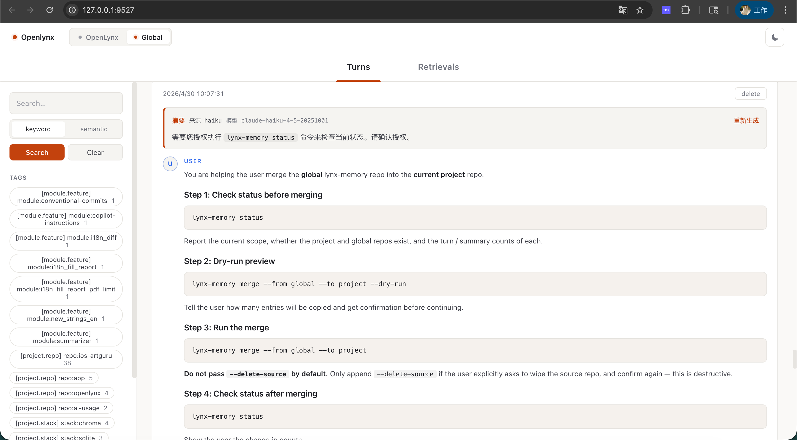

# lynx-memory

[English README](./README.md)

为 [Claude Code](https://claude.com/claude-code) 提供持久、语义化的长期记忆。
对话会跨会话自动保存，每次你提交新消息时，最相关的历史片段会自动注入上下文——
不需要特殊语法，也不用说"还记得 XX 吗"。

```
你       : 明天天气好的话，我可以有哪些活动，比如遛狗
Claude   : 结合你有蛋蛋（金色边牧）这个大运动量的伙伴，可以安排长距离散步、
           玩飞盘、城市绿道骑行带它跟跑…… 🐶
            （你没提"蛋蛋"，也没说自己养狗——记忆从过往聊天里自动召回）
```

## 工作原理

三个 Claude Code [hooks](https://docs.claude.com/en/docs/claude-code/hooks) + 一个小 Python 服务：

| Hook                | 作用                                                  |
| ------------------- | ----------------------------------------------------- |
| `UserPromptSubmit`  | 把你的 prompt 向量化，注入最相似的 K 条历史对话；命中的 turn 若已有摘要，注入的是**摘要**而不是原文 |
| `Stop`              | 把本轮 user/assistant 对话存入 SQLite + Chroma，并 **detached fork** 一个后台摘要进程，通过配置好的 API（Anthropic 或 OpenAI）从本轮对话中提取长期记忆 |
| `SessionEnd`        | 调用配置的 API，给整段会话生成一份粗粒度记忆摘要       |

存储方式：

- **SQLite** — 原始对话、每轮摘要、会话级摘要的真实数据源
- **Chroma** — 本地向量索引（turns + 摘要）
- **Voyage AI** (`voyage-3`) — 文本向量化服务
- **Anthropic**（默认，`claude-haiku-4-5-20251001`）或 **OpenAI**（`gpt-4o-mini`）— 每轮摘要与会话摘要，需配置 `ANTHROPIC_API_KEY` 或 `OPENAI_API_KEY`

## 安装

```bash
pip install openlynx
lynx-memory init
```

`init` 会：

1. 创建数据目录 `~/.claude/lynx-memory/`
2. 提示你输入 `VOYAGE_API_KEY`（免费申请：https://www.voyageai.com/）
3. 写入默认配置：`MIN_SCORE=0.7`、`SUMMARY_ENABLED=1`、
   `SUMMARY_MODEL=claude-haiku-4-5-20251001`、`SUMMARY_BACKEND=auto`；
   设置 `ANTHROPIC_API_KEY` 或 `OPENAI_API_KEY` 以启用每轮摘要
   （也可以之后在 Web UI ⚙ 设置面板里配置）
4. 备份现有的 `~/.claude/settings.json`，注入三个 hook
5. 打印验证步骤

然后开一个新的 Claude Code 会话，聊几轮后跑：

```bash
lynx-memory status
```

你应该能看到 `turns` 和 `chroma_turns` 在涨。

## Codex CLI（跨宿主记忆）

同一份记忆库也可以接入 [Codex CLI](https://developers.openai.com/codex/cli)：

```bash
lynx-memory init --target codex   # 或 --target all 同时安装两边
```

会写入 `~/.codex/hooks.json`，在 `~/.codex/config.toml` 设置
`[features] hooks = true`，并注册三个 hook（`UserPromptSubmit` →
注入；`Stop` → 持久化；`SessionStart` → 给上一段会话生成摘要，
因为 Codex 没有 `SessionEnd` 事件）。

Codex 的 `additionalContext` 字段会被完整尊重，记忆注入方式与
Claude Code 一致。**hook 在会话启动时加载，请重启正在运行的
`codex` 进程后才会生效。**

在 Claude Code 写下的对话可以在 Codex 里被召回（反之亦然），
因为两边都写入同一个 `~/.claude/lynx-memory/` 下的 SQLite + Chroma 仓库。

## 命令

```
lynx-memory init           安装 hooks 与 slash 命令
lynx-memory init-project   在当前目录创建 .lynx-memory/ 标记，启用项目级存储
lynx-memory status         查看数据目录、hook 注册情况、数据库统计
lynx-memory doctor         自检 Python、依赖、API key、settings.json
lynx-memory merge          在项目级 / 全局两个仓库之间合并记忆
                             （--from / --to 选 project|global，可选 --dry-run）
lynx-memory retag          给历史 turn 回填结构化自动标签
                             （--scope project|global|both，可选 --dry-run / --limit）
lynx-memory delete         永久删除某个 scope 的记忆
                             （--scope project|global|both，默认带二次确认）
lynx-memory uninstall      卸载 hooks 与 slash 命令（保留数据）
```

## Slash 命令

`lynx-memory init` 会顺带把以下五个全局 slash 命令安装到 `~/.claude/commands/`，
在任意 Claude Code 会话里直接调用：

| 命令                          | 作用                                                 |
| ----------------------------- | ---------------------------------------------------- |
| `/lynx-memory-status`       | 查看当前是项目级还是全局，并显示两个仓库的统计       |
| `/lynx-memory-pull-global`  | 把全局历史会话合并到当前项目（global → project）     |
| `/lynx-memory-push-global`  | 把当前项目的历史会话合并到全局（project → global）   |
| `/lynx-memory-delete`       | 永久删除记忆，对话里强制双重确认（输 `DELETE` + `y`）|
| `/lynx-memory-history`      | 打开本地 Web UI 浏览历史，支持搜索、打标签、删除     |

这些命令是 Claude 自然语言执行模板，会自动跑 `lynx-memory status` /
`merge --dry-run` 预览，并在合并 / 删除前征得你的同意。

## Web UI



在 Claude Code 里输 `/lynx-memory-history`（或直接跑 `lynx-memory web`），
会在 `127.0.0.1` 启动一个 FastAPI + React 的本地服务并自动开浏览器。在页面里你可以：

- 在 **项目级** 与 **全局** 之间一键切换
- 翻页浏览所有 turn
- **关键字**（SQL `LIKE`）或 **语义** 搜索（基于 Voyage 向量）
- 给单条 turn 打标签（如 `#work`、`#personal`），并按标签过滤
- 自动生成**类型化标签**，区分 `user` / `project` / `module` / `custom`
- 删除单条 turn（同时清掉 Chroma 里的向量）
- 每条 turn 顶部显示**摘要**，可一键"重新生成"
- 点击右上角 **⚙ 设置图标** 打开**设置面板**，在浏览器里直接配置所有选项：API Key、摘要后端（Anthropic / OpenAI）、模型、Top-K、相似度阈值、召回范围——保存后自动写入 `~/.claude/lynx-memory/.env`

### 使用方式

```bash
# 默认 —— 监听 http://127.0.0.1:9527 并自动开浏览器
lynx-memory web

# 换端口
lynx-memory web --port 8080

# 让系统挑一个空闲端口
lynx-memory web --port 0

# 不自动开浏览器（headless / SSH 场景）
lynx-memory web --no-open
```

UI 上的操作直接落库：

| 操作         | 实际写入                                                              |
| ------------ | --------------------------------------------------------------------- |
| **删除 turn**| 同步删 SQLite 的 `turns` / `turn_tags` 行 + Chroma 向量               |
| **加标签**   | 写入 SQLite 的 `tags`（不存在则新建）和 `turn_tags`                   |
| **移除标签** | 删 `turn_tags`；如果该标签没人用了，再清 `tags` 里的孤立行            |
| **关键字搜索**| SQL `LIKE` 直查 `user_msg` / `assistant_msg`，不调用 embedding 接口 |
| **语义搜索** | 调一次 Voyage 算 query 向量，再从 Chroma 取 top-K                     |
| **重新生成摘要** | 调一次 API（Anthropic 或 OpenAI，取决于 `SUMMARY_BACKEND`），把 `summary` / `summary_model` / `summary_ts` 写回 `turns` |

服务只监听 `127.0.0.1`，按 `Ctrl+C` 关闭。

### 标签类型

为了让记忆更稳定地被组织和召回，标签现在分为几类更细的 taxonomy：

- `user.role`：用户级角色信息，例：`role:产品经理`
- `user.preference`：用户偏好 / 习惯，例：`preference:偏好简洁回答`
- `project.repo`：项目或仓库身份，例：`repo:openlynx`
- `project.stack`：稳定技术栈，例：`stack:react`、`stack:fastapi`
- `module.feature`：当前轮对话关联的模块 / 功能域，例：`module:storage`
- `custom`：手工补充标签，继续兼容原来的自由标签

其中 `user.*` / `project.*` / `module.*` 会在 turn 落库时做一轮本地规则式自动打标；语义检索阶段还会按标签类型轻量重排，让 `user` 级记忆比 `module` 级记忆更容易被优先召回。

历史数据可以用下面的命令回填：

```bash
# 先预览会影响多少条
lynx-memory retag --scope both --dry-run

# 正式写回
lynx-memory retag --scope both
```

## 项目级 vs 全局

默认全局共享。在某个项目根目录跑：

```bash
cd ~/code/my-project
lynx-memory init-project
```

会创建 `.lynx-memory/` 标记目录。之后只要 cwd 在该项目内，记忆就自动切到
项目级仓库 `<project>/.lynx-memory/db/`，与全局 `~/.claude/lynx-memory/`
互不污染。

随时用 `/lynx-memory-status` 查看当前 scope，用 `/lynx-memory-pull-global`
/ `/lynx-memory-push-global` 在两层之间搬运历史。

## 配置

全部可选，写在 `~/.claude/lynx-memory/.env`：

| 变量                            | 默认值                              | 用途                              |
| ------------------------------- | ----------------------------------- | --------------------------------- |
| `VOYAGE_API_KEY`                | —                                   | 必填，向量化用                    |
| `TOP_K`                         | `5`                                 | 每次注入的最多记忆条数            |
| `MIN_SCORE`                     | `0.7`                               | 相似度下限（0–1）                 |
| `SUMMARY_ENABLED`               | `1`                                 | 设为 `0`/`false` 关闭每轮摘要     |
| `SUMMARY_BACKEND`               | `auto`                              | `auto`：有 `ANTHROPIC_API_KEY` 时走 Anthropic，否则走 OpenAI；可强制 `sdk` 或 `openai` |
| `SUMMARY_MODEL`                 | `claude-haiku-4-5-20251001`         | Anthropic 每轮摘要用的模型        |
| `ANTHROPIC_API_KEY`             | —                                   | `SUMMARY_BACKEND=sdk` 或 `auto`（无 OpenAI key）时必填 |
| `OPENAI_API_KEY`                | —                                   | `SUMMARY_BACKEND=openai` 时必填   |
| `OPENAI_MODEL`                  | `gpt-4o-mini`                       | OpenAI 摘要用的模型               |
| `OPENAI_BASE_URL`               | `https://api.openai.com/v1`         | 兼容 OpenAI 协议的自定义端点      |
| `LYNX_MEMORY_DIR`             | `~/.claude/lynx-memory`           | SQLite + Chroma 数据目录          |
| `LYNX_MEMORY_SUMMARY_MODEL`   | `claude-haiku-4-5-20251001`         | `SessionEnd` 会话摘要用的 Anthropic 模型 |

## 可选：MCP 服务

也可以把记忆暴露为 MCP 工具（`search_memory` / `list_recent` / `stats` / `forget`），
让 Claude 主动检索。在 `~/.claude.json` 或 `.mcp.json` 加：

```json
{
  "mcpServers": {
    "lynx-memory": {
      "command": "lynx-memory-mcp"
    }
  }
}
```

## 卸载

```bash
lynx-memory uninstall                   # 移除 hooks 与 slash 命令
lynx-memory delete --scope global       # 删除全局存储数据（带确认）
# 或
rm -rf ~/.claude/lynx-memory            # 直接 rm（不可逆）
```

## 隐私说明

- 所有数据保存在你本机的 `~/.claude/lynx-memory/`
- 外部请求：**Voyage AI**（embedding，包含你的 prompt 文本）；**Anthropic** 或 **OpenAI**
  用于每轮和会话级摘要（需配置 API Key，可通过 `.env` 或 Web UI ⚙ 设置面板配置）
- 不想让每轮内容被发去做摘要的话，设 `SUMMARY_ENABLED=0`
- 想加密静态数据的话，把 `LYNX_MEMORY_DIR` 指向一个加密卷即可

## Roadmap

- [x] **项目级 / 全局双层存储**
  默认全局共享，进入含 `.lynx-memory/` 标记的项目目录后自动切换到项目级，避免不同项目的历史互相污染。在项目根目录运行 `lynx-memory init-project` 创建标记。检索支持 `scope=auto|project|global|merged`（hooks 通过 `LYNX_MEMORY_SCOPE` 环境变量切换；MCP 工具直接传 `scope` 参数）。

- [x] **Codex CLI** — 已通过 hooks 接入，与 Claude Code 共用同一套存储；使用 `lynx-memory init --target codex`（或 `--target all`）。详见上文「Codex CLI（跨宿主记忆）」一节。

- [x] **本地 Web UI 记忆浏览器**
  基于 FastAPI + React 的本地可视化界面，支持翻页浏览、关键字 / 语义搜索、单条删除、打标签（如 `#work` `#personal`）等操作。通过 slash 命令 `/lynx-memory-history`（或 `lynx-memory web`）打开，页面同时展示项目级与全局的历史对话，可一键切换。

- [ ] **其他 CLI（Cursor、Gemini CLI 等）** — 尚未接入。**Cursor**：需等待官方开放可用的 hooks 能力后再对接（当前策略是先等 hook）；在此之前仍可按需使用 MCP 等方式。
- [ ] **统一多客户端安装器**
  未来提供 `lynx-memory install --client <name>` 一键写入 MCP 配置，并为支持的客户端附带强制召回的 rules 模板。

- [ ] **记忆导入 / 导出与跨设备同步**
  提供 `lynx-memory export` / `import` 命令，支持 JSONL 格式备份与恢复；配合 iCloud / Dropbox / Git 仓库放置 `db/` 目录，或内置 `lynx-memory sync` 子命令，实现多台设备记忆共享。

- [ ] **更强的自动打标签（精准 / 联想）**
  在现有规则式 `retag` 与类型化标签体系之上，增强对对话的自动打标能力；支持在 **精准模式**（紧贴字面、便于核对）与 **联想模式**（更宽关联、利于语义召回）之间切换。

- [ ] **召回模式与可配置优先级**
  在纯语义相似度之外，支持按 **召回次数**、**最相关**（相似度得分）、**最近使用**（最近命中/注入）等信号组合排序；提供预设模板，并允许手动调节权重或优先级规则。

## 协议

MIT — 详见 [LICENSE](./LICENSE)。
